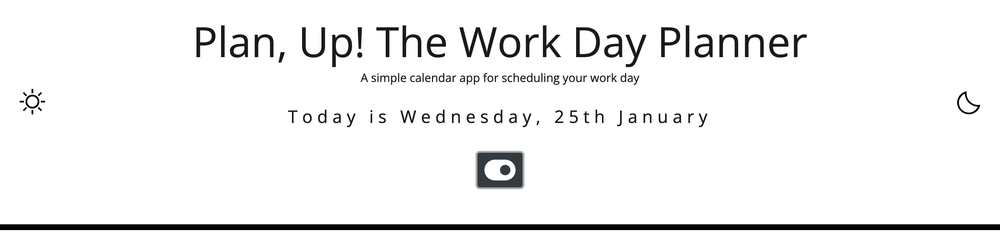
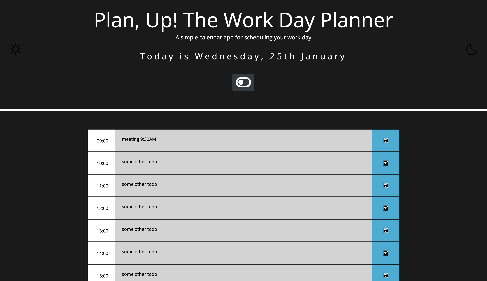

<!-- Readme top-->

<!-- Project shields -->

<!-- centered shields -->

  [![Stargazers][stars-shield]][stars-url]
  [![Issues][issues-shield]][issues-url]
  [![MIT License][license-shield]][license-url]
  [![LinkedIn][linkedin-shield]][linkedin-url]

<!-- Readme Header -->

  

#
<h2 align="center">Plan, UP! A simple work day planner for scheduling your day.</h2>

  

    A very basic day planner that needs a lot more styling. 
     
    <a href="https://github.com/Matt-Jones-Developer/plan_up-daily_planner/"><strong>Explore the docs »</strong></a>
     
     
    <a href="https://github.com/Matt-Jones-Developer/plan_up-daily_planner">View Project</a>
    ·
    <a href="https://github.com/Matt-Jones-Developer/plan_up-daily_planner/issues">Report Bug</a>
    ·
    <a href="https://github.com/Matt-Jones-Developer/plan_up-daily_planner/issues">Request Feature</a>
    ·
    <a href="https://github.com/Matt-Jones-Developer/">Check out my github</a>
    ·
  

#

<!-- TABLE OF CONTENTS -->

  
Table of Contents

  <ol>
    <li>
      <a href="#about-the-project">About The Project</a>
      <ul>
        <li><a href="#built-with">Built With</a></li>
      </ul>
    </li>
    <li>
      <a href="#getting-started">Getting Started</a>
      <ul>
        <li><a href="#prerequisites">Prerequisites</a></li>
        <li><a href="#installation">Installation</a></li>
      </ul>
    </li>
    <li><a href="#usage">Usage</a></li>
    <li><a href="#roadmap">Roadmap</a></li>
    <li><a href="#contributing">Contributing</a></li>
    <li><a href="#license">License</a></li>
    <li><a href="#contact">Contact</a></li>
    <li><a href="#acknowledgments">Acknowledgments</a></li>
  </ol>

<!-- ABOUT THE PROJECT -->
## About The Project

  

I simple day planner to help get your work day organised.  Set an a new todo entry in a time block and hit the save button to store it.
Upon refresh, the data persists.  A light/dark mode button is also featured.

## Overview
 
Another confused, frustrating effort to achieve something that seemed so simple; yet I do not feel like I acknowledged how to accomplish this at all.  I studied the weeks notes, re-watched videos, thought the Todo app was the clue, eventually got there, very painfully.  Compounded by Jquery made it worse. 

---
## Overview: MID-COURSE RANT: (*warning!*)
#
This course needs to teach me how to be an amazing front-end developer, to think like an actual programmer, I need to be fluent in Javascript and CSS - I am finding the last few weeks material to be too far removed from what I need currently - confidence in good programming, ability to solve problems etc.
I wish we could spend way more time on vanilla Javascript, advanced CSS and design stuff.  My icons are a mess and the dark/light icon is broken.  

#

<!-- the product -->

## The Product

Product screenshot:

[![Product Name Screen Shot][product-screenshot]](https://github.com/Matt-Jones-Developer/plan_up-daily_planner)

## Criteria

The app should:

* Display the current day at the top of the calender when a user opens the planner.
 
* Present timeblocks for standard business hours when the user scrolls down.
 
* Color-code each timeblock based on past, present, and future when the timeblock is viewed.
 
* Allow a user to enter an event when they click a timeblock

* Save the event in local storage when the save button is clicked in that timeblock.

* Persist events between refreshes of a page

#

(<a href="#readme-top">back to top</a>)

### Built With:

<!-- languages logos -->
![jquery-logo]::: [![JQUERY]][jquery-url]
![js-logo]::: [![JavaScript]][javascript-url] ![html5-logo]::: [![HTML5]][html5-url]![css-logo]::: [![CSS]][css-url]

(<a href="#readme-top">back to top</a>)

#

<!-- GETTING STARTED -->
## Getting Started

This project has a single html page, with a main.js file.  The app will run in your browser.
When you enter a 9AM appointment, it will save to localStorage.  Upon refresh it will be retrieved from localStorage.  The Light/Dark mode almost done, some poor styling done, but if I am having to spend 20 hours trying to figure out why I don't understand what's being asked, that's the best I can do.

I have yet to get this app improved and will resubmit. 

#
### Prerequisites

N/A

#

### Installation

No installation required.  Just load your browser.

----------------------------------

<!-- USAGE EXAMPLES -->
## Usage and Screenshots

Screenshot of the programs output;

![main-app-screenshot]

Console log:

![console-output-screenshot]

(<a href="#readme-top">back to top</a>)

----------------------------------

<!-- ROADMAP -->
## Roadmap

1. complete all initial criteria - must get all the logic working 
2. improve on the existing features and add new ones
3. improve the UI and add my UX design principles

(<a href="#readme-top">back to top</a>)

#

<!-- CONTRIBUTING -->
## Contributing

N/A

#

<!-- LICENSE -->
## License

Distributed under the MIT License. See `LICENSE.txt` for more information.

(<a href="#readme-top">back to top</a>)

#

<!-- CONTACT -->
## Contact

Matt Jones - [@glitchy81_dev](https://twitter.com/glitchy81_dev)

#

## Project links

Project Repo Link: [https://github.com/Matt-Jones-Developer/plan_up-daily_planner](https://github.com/Matt-Jones-Developer/plan_up-daily_planner)

Deployed Project Link: [https://matt-jones-developer.github.io/plan_up-daily_planner](https://matt-jones-developer.github.io/plan_up-daily_planner)

(<a href="#readme-top">back to top</a>)

<!-- ACKNOWLEDGMENTS -->
## Acknowledgments

* [Developed from this original README Template](https://github.com/othneildrew/Best-README-Template)

(<a href="#readme-top">back to top</a>)

<!-- MARKDOWN LINKS & IMAGES -->
<!-- https://www.markdownguide.org/basic-syntax/#reference-style-links -->
[contributors-shield]: https://img.shields.io/github/contributors/matt-jones-developer/plan_up-daily_planner.svg?style=for-the-badge
[contributors-url]: https://github.com/matt-jones-developer/plan_up-daily_planner/graphs/contributors
[forks-shield]: https://img.shields.io/github/forks/matt-jones-developer/plan_up-daily_planner.svg?style=for-the-badge
[forks-url]: https://github.com/Matt-Jones-Developer/plan_up-daily_planner/network/members
[stars-shield]: https://img.shields.io/github/stars/matt-jones-developer/plan_up-daily_planner.svg?style=for-the-badge
[stars-url]: https://matt-jones-developer.github.io/plan_up-daily_planner/stargazer
[issues-shield]: https://img.shields.io/github/issues/matt-jones-developer/plan_up-daily_planner.svg?style=for-the-badge
[issues-url]: https://github.com/Matt-Jones-Developer/plan_up-daily_planner/issues
[license-shield]: https://img.shields.io/github/license/matt-jones-developer/plan_up-daily_planner.svg?style=for-the-badge
[license-url]: https://github.com/Matt-Jones-Developer/plan_up-daily_planner/blob/main/LICENSE.txt
[linkedin-shield]: https://img.shields.io/badge/-LinkedIn-black.svg?style=for-the-badge&logo=linkedin&colorB=555
[linkedin-url]: www.linkedin.com/in/matt-jones-zx81
[main-app-screenshot]: assets/images/screenshots/planner_main_darkmode.png
[product-screenshot]: assets/images/screenshots/planner_main.png
[console-output-screenshot]: assets/images/screenshots/planner_local_save.png
[jquery-url]: https://jquery.com/
[javascript-url]: https://www.javascript.com
[html5-url]: https://html5.org/
[css-url]: https://www.w3.org/Style/CSS/Overview.en.html
[jquery-logo]: assets/images/logos/logo-jquery.png
[js-logo]: assets/images/logos/js.svg
[html5-logo]: assets/images/logos/html5.svg
[css-logo]: assets/images/logos/css3.svg

